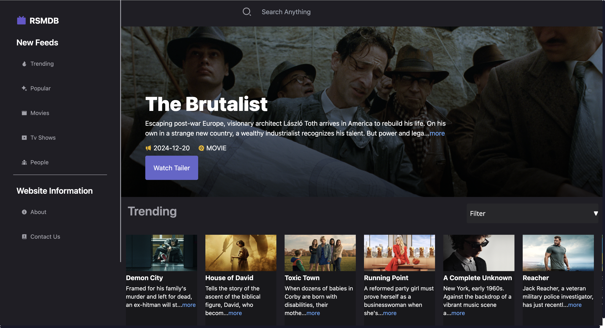
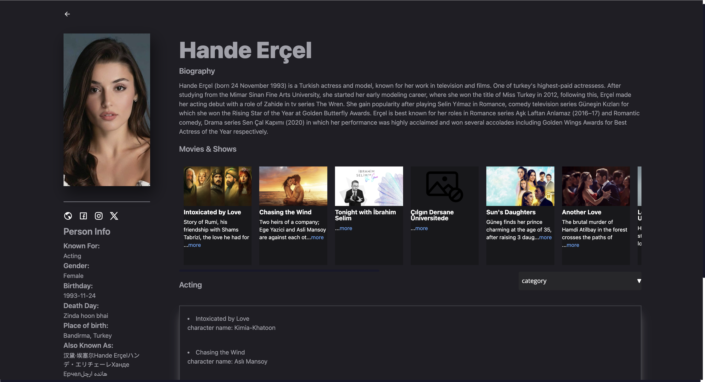
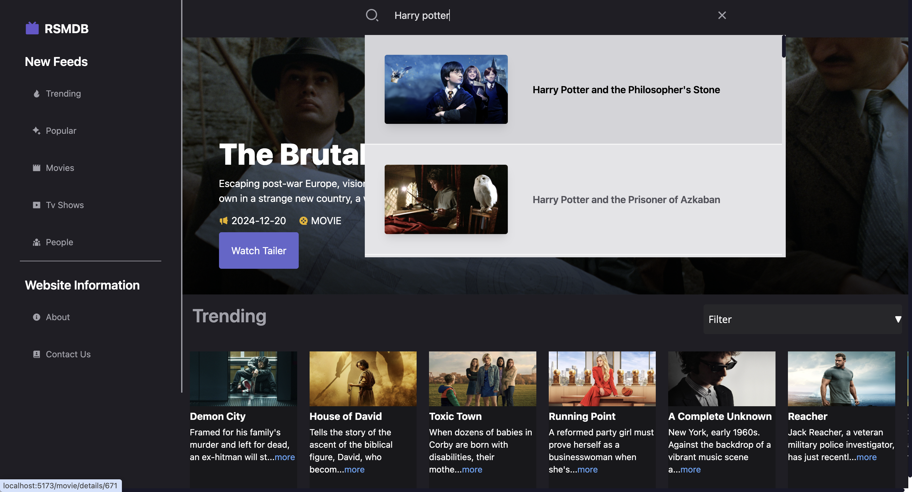

# 🎬 Movie Explorer

## 📌 Overview
Movie Explorer is a React-based web application that allows users to search for movies, explore trending and popular films, TV shows, and actors, and view detailed information about them. Users can watch trailers, check ratings, and find where movies are available for streaming.

## Visit Here
[Movie-Explorer](https://movie-explorer-blush.vercel.app/)
## 🚀 Features
- 🔍 **Search Movies & TV Shows**: Find movies and TV shows using the search bar.
- 🎥 **Trending & Popular Sections**: Explore trending movies, popular films, and TV shows.
- 🎭 **People Section**: View details about actors, including their biography and filmography.
- 🖼️ **Movie & Actor Cards**: Displays an image and mini description, leading to a detailed page.
- 🎬 **Movie Details**: Includes the banner, rating, streaming platforms, similar movies, and trailers.
- ▶️ **Watch Trailers**: Directly view movie trailers via YouTube integration.
- 🔄 **Infinite Scrolling**: Smooth scrolling for seamless browsing.
## 📸 Screenshots
Here are some visuals of the application:

### 🏠 Home Page


### 🔥 Trending Section


### 🌟 Popular Section


### 📺 TV Shows


### 📜 Detailed TV Show


### 🎞️ Movie Details


### 👥 Actors


### 🎭 Actor Details


### 🔍 Search Box


### 🎬 Trailer View


## 🛠️ Technologies Used
- **React** (UI Framework)
- **Redux Toolkit** (State Management)
- **React Router** (Navigation)
- **Axios** (API Requests)
- **React Infinite Scroll Component** (Seamless scrolling experience)
- **React Player** (YouTube trailer integration)
- **Tailwind CSS** (Styling)
- **Vite** (Development & Build tool)

## 📌 Prerequisites
Before you begin, ensure you have the following installed:
- **Node.js** (v16 or higher)
- **A Movie Database API Key** (e.g., TMDb API)

## 🔧 Installation & Setup
1. Clone the repository:
   ```bash
   git clone https://github.com/yourusername/movie-explorer.git
   cd movie-explorer
   ```
2. Install dependencies:
   ```bash
   npm install
   ```
3. Create a `.env` file and add your API key:
   ```env
   VITE_API_KEY=your_tmdb_api_key
   ```
4. Start the development server:
   ```bash
   npm run dev
   ```
5. Open `http://localhost:5173` in your browser.

## 🎯 Contributing
Contributions are welcome! Feel free to fork the repository and submit a pull request.

## 📄 License
This project is licensed under the MIT License.

